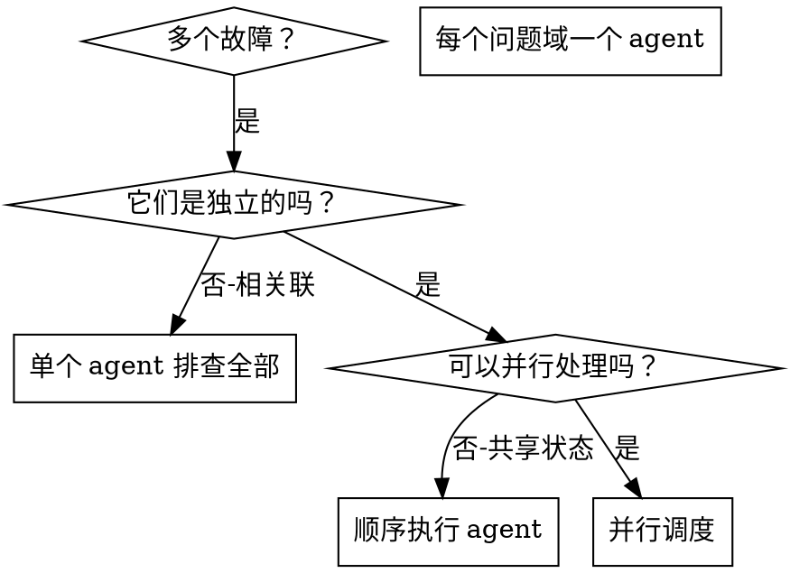

# 调度并行 Agent

## 概述

你将任务委派给具有隔离上下文的专业 agent。通过精确构建它们的指令和上下文，确保它们保持专注并成功完成任务。它们不应继承你当前会话的上下文或历史——你只需构建它们所需的内容。这也为你自己的上下文保留了空间，用于协调工作。

当出现多个不相关的故障（不同的测试文件、不同的子系统、不同的 bug）时，按顺序逐一排查会浪费时间。每次排查都是独立的，可以并行进行。

**核心原则：** 每个独立的问题域派遣一个 agent。让它们并发工作。

## 何时使用



**适用于：**
- 3个以上测试文件因不同根因失败
- 多个子系统独立故障
- 每个问题无需其他问题的上下文即可理解
- 排查之间无共享状态

**不适用于：**
- 故障相互关联（修复一个可能同时修复其他）
- 需要了解完整系统状态
- agent 之间会相互干扰

## 模式

### 1. 识别独立的问题域

按故障类型分组：
- 文件 A 测试：工具审批流程
- 文件 B 测试：批量完成行为
- 文件 C 测试：中止功能

每个域都是独立的——修复工具审批不影响中止测试。

### 2. 创建聚焦的 Agent 任务

每个 agent 获得：
- **明确范围：** 一个测试文件或子系统
- **清晰目标：** 让这些测试通过
- **约束条件：** 不要修改其他代码
- **预期输出：** 发现和修复内容的摘要

### 3. 并行调度

```typescript
// 在 Claude Code / AI 环境中
Task("修复 agent-tool-abort.test.ts 的失败用例")
Task("修复 batch-completion-behavior.test.ts 的失败用例")
Task("修复 tool-approval-race-conditions.test.ts 的失败用例")
// 三个任务并发运行
```

### 4. 审查与整合

当 agent 返回结果时：
- 阅读每个摘要
- 验证修复不冲突
- 运行完整测试套件
- 整合所有变更

## Agent 提示词结构

好的 agent 提示词应：
1. **聚焦** — 一个清晰的问题域
2. **自包含** — 包含理解问题所需的全部上下文
3. **输出明确** — agent 应该返回什么？

```markdown
修复 src/agents/agent-tool-abort.test.ts 中的 3 个失败测试：

1. "should abort tool with partial output capture" - 期望消息中包含 'interrupted at'
2. "should handle mixed completed and aborted tools" - 快速工具被中止而非完成
3. "should properly track pendingToolCount" - 期望 3 个结果但得到 0

这些是时序/竞态条件问题。你的任务：

1. 阅读测试文件，理解每个测试验证什么
2. 确定根因——是时序问题还是真正的 bug？
3. 通过以下方式修复：
   - 用基于事件的等待替代任意超时
   - 如果发现中止实现中的 bug，则修复
   - 如果测试验证的是已变更的行为，则调整测试预期

不要只是增加超时时间——找到真正的问题。

返回：发现的问题和修复内容的摘要。
```

## 常见错误

**❌ 太宽泛：** "修复所有测试" — agent 会迷失方向
**✅ 具体：** "修复 agent-tool-abort.test.ts" — 范围聚焦

**❌ 无上下文：** "修复竞态条件" — agent 不知道在哪里
**✅ 有上下文：** 粘贴错误消息和测试名称

**❌ 无约束：** agent 可能重构一切
**✅ 有约束：** "不要修改生产代码" 或 "只修复测试"

**❌ 输出模糊：** "修复它" — 你不知道改了什么
**✅ 输出明确：** "返回根因和变更的摘要"

## 何时不使用

**关联故障：** 修复一个可能修复其他——先一起排查
**需要完整上下文：** 理解需要看到整个系统
**探索性调试：** 你还不知道哪里坏了
**共享状态：** agent 会互相干扰（编辑相同文件、使用相同资源）

## 实际案例

**场景：** 重大重构后 3 个文件共 6 个测试失败

**失败详情：**
- agent-tool-abort.test.ts: 3 个失败（时序问题）
- batch-completion-behavior.test.ts: 2 个失败（工具未执行）
- tool-approval-race-conditions.test.ts: 1 个失败（执行次数 = 0）

**决策：** 独立的问题域——中止逻辑与批量完成与竞态条件互不相关

**调度：**
```
Agent 1 → 修复 agent-tool-abort.test.ts
Agent 2 → 修复 batch-completion-behavior.test.ts
Agent 3 → 修复 tool-approval-race-conditions.test.ts
```

**结果：**
- Agent 1：用基于事件的等待替代超时
- Agent 2：修复事件结构 bug（threadId 位置错误）
- Agent 3：添加异步工具执行完成的等待

**整合：** 所有修复相互独立，无冲突，完整套件通过

**节省时间：** 3 个问题并行解决 vs 顺序解决

## 核心优势

1. **并行化** — 多个排查同时进行
2. **聚焦** — 每个 agent 范围窄，需要跟踪的上下文更少
3. **独立性** — agent 之间不互相干扰
4. **速度** — 3 个问题用 1 个问题的时间解决

## 验证

agent 返回后：
1. **审查每个摘要** — 理解变更内容
2. **检查冲突** — agent 是否编辑了相同代码？
3. **运行完整套件** — 验证所有修复协同工作
4. **抽查** — agent 可能犯系统性错误

## 实际影响

来自调试会话（2025-10-03）：
- 3 个文件中共 6 个失败
- 3 个 agent 并行调度
- 所有排查并发完成
- 所有修复成功整合
- agent 变更之间零冲突
